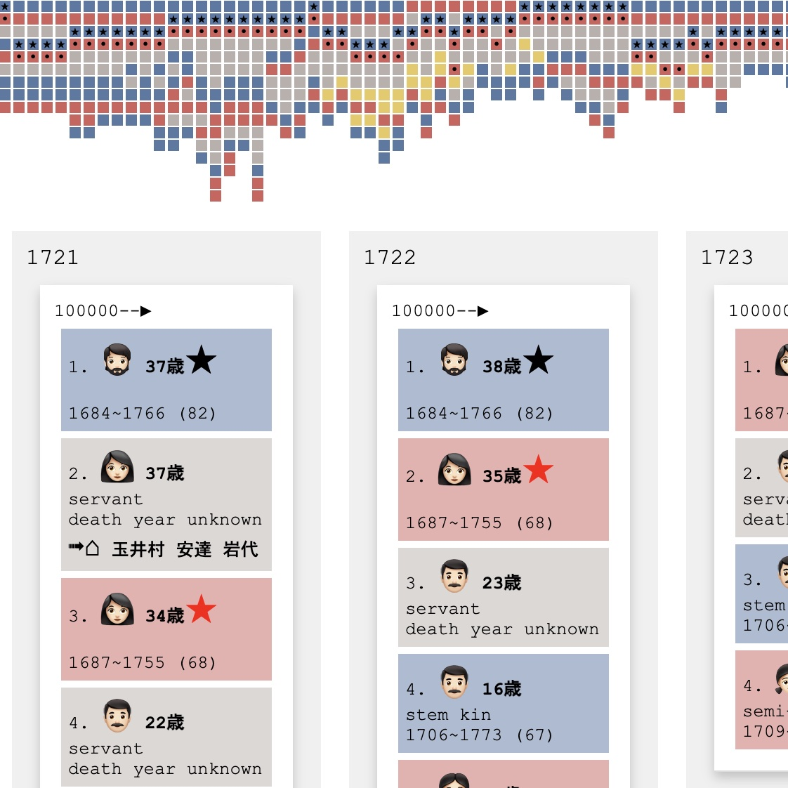

# MaChiZu

MaChiZu is an space that merges 「町」(town) and 「地図」(maps). We present a series of "thick maps," visual representations that evoke dialogue. Each piece is a confluence of urban digital expressions, experimentations that are constantly evolving, and contestable by nature. 

## Portfolio

	

		<a href="projects/xymax">
			
			
Tokyo 3D

		</a>
	

	

		<a href="edo">
			
			
Edo Families

		</a>
	

	

		<a href="tomoni">
			
			
Ethnography in Fukushima

		</a>
	

